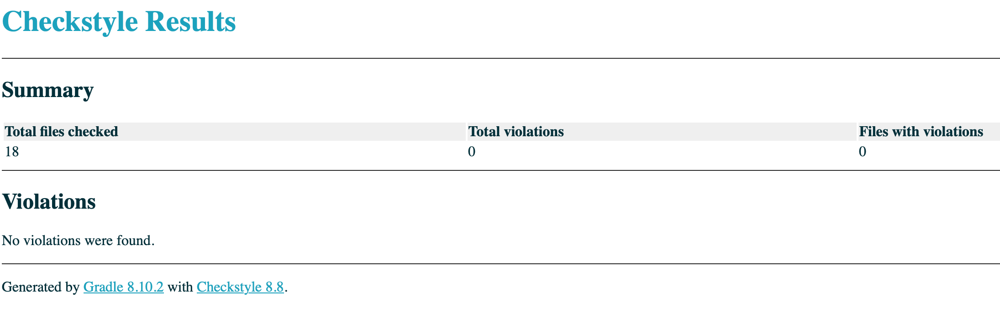
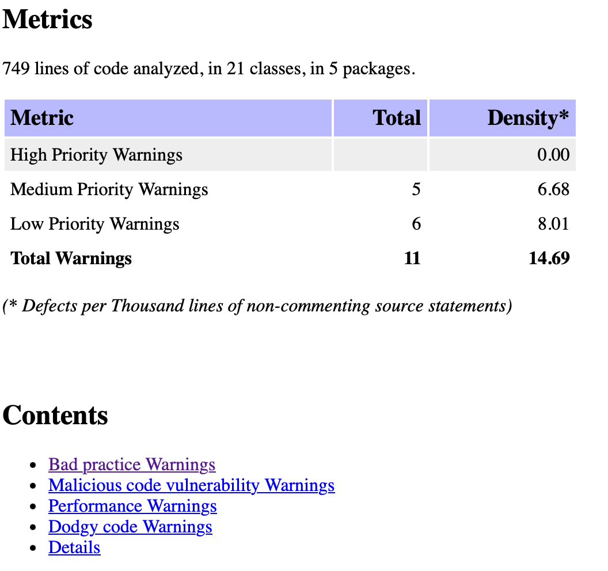
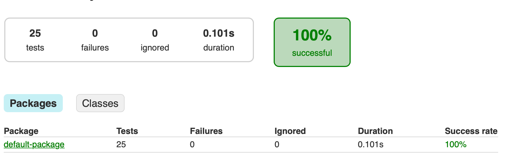

# **SiliconVSim: Tech Startup Battle Simulator**

## **Overview**
The **SiliconVSim** project simulates a competitive landscape where Tech Giants manage startups and engage in battles based on various strategies and market events. 
The system uses Java's Object-Oriented Programming principles and applies critical design patterns to ensure maintainable, scalable, and testable code.

The project integrates tools such as **JUnit** for testing, **Jacoco** for code coverage, **CheckStyle** for enforcing code style, and **SpotBugs** for 
static analysis to ensure a high-quality codebase.

---

## **Features**
1. **Tech Giants** managing **Startups**.
2. Quarter-based **market events** that influence gameplay.
3. **Startup battles** using attack strategies, critical hits, and event-based advantages.
4. A **simulation engine** that iterates through quarters until specific conditions are met.
5. Extensive use of **design patterns** for modularity and flexibility.

---

## **Design Patterns**
### 1. **Singleton Pattern**
**Class:** `QuarterCycle`

**Purpose:** Ensures only one instance of the quarter cycle exists for the entire simulation.

- **How It Works:** 
  - The `QuarterCycle` class initializes a circular linked list of the four quarters (`FirstQuarter`, `SecondQuarter`, etc.).
  - The `getSingleQuarterInstance()` method ensures that only one instance of `QuarterCycle` exists and is reused throughout the simulation.

- **Why:** This prevents multiple, inconsistent quarter cycles from being created, ensuring a unified flow of events in the simulation.

---

### 2. **Observer Pattern**
**Classes:** `Event`, `TechGiant`, and `EventObserver`

**Purpose:** Enables dynamic communication between the market events (`Event`) and the Tech Giants (`TechGiant`).

- **How It Works:**
  - **`Event` Class**: Maintains a list of observers (Tech Giants).
  - **`TechGiant` Class**: Implements the `EventObserver` interface and updates its state when notified.
  - On a quarterly event update, the `Event` class notifies all its observers using the `notifyObservers()` method.

- **Why:** Allows the Tech Giants to react dynamically to market events without tightly coupling the event and Tech Giant classes.

---

### 3. **Builder Pattern**
**Class:** `TechGiantBuilder`

**Purpose:** Simplifies the construction of complex `TechGiant` objects with optional parameters.

- **How It Works:**
  - The `TechGiantBuilder` class provides chained setter methods (`setName`, `setFunds`, etc.) for specifying attributes.
  - The `build()` method constructs and returns a fully initialized `TechGiant` object.

- **Why:** Provides flexibility in creating `TechGiant` objects without requiring multiple constructors or hard-to-read initialization code.

---

### 4. **Decorator Pattern**
**Class:** `BattleAdvantageDecorator`

**Purpose:** Dynamically adds event-based advantages (like attack boosts) to startups during battles.

- **How It Works:**
  - The `BattleAdvantageDecorator` wraps around a `StartUp` object and overrides its methods to apply additional logic (e.g., attack boosts during battles).
  - For example, `calculateDamageWithAdvantage` applies a percentage-based damage boost based on the event or matchup.

- **Why:** Allows additional functionality to be added to a `StartUp` object without modifying its base class.

---

## **Core Classes**
### 1. **TechGiant**
Represents a Tech Giant managing a portfolio of startups.

- **Key Responsibilities:**
  - Maintain a list of startups.
  - Invest in startups.
  - Respond to quarterly market events.
  - Engage in startup battles.

### 2. **StartUp**
Represents a startup with attributes like revenue, market share, and attack capabilities.

- **Key Responsibilities:**
  - Perform attacks during battles.
  - React to market events.
  - Track and update performance metrics (e.g., revenue, XP).

### 3. **QuarterCycle**
Manages the simulation's quarterly flow using a circular linked list.

- **Key Responsibilities:**
  - Provide the current quarter.
  - Advance to the next quarter.

### 4. **Event**
Handles the notification of market events to all registered observers.

- **Key Responsibilities:**
  - Notify Tech Giants of quarterly events.
  - Manage the list of observers.

### 5. **Battle**
Simulates battles between startups or a startup and a wildcard.

- **Key Responsibilities:**
  - Manage battle logic (e.g., critical hits, damage calculation).
  - Apply event-based advantages using the decorator pattern.
  - Determine the winner of a battle.

---

## **Testing**
The project uses **JUnit** for unit testing. Key tests include:

1. **Tech Giant Event Notification Test**
   - Verifies that Tech Giants correctly update their state when notified of market events.

2. **Battle Logic Tests**
   - Tests critical hit calculations, event-based advantages, and battle outcomes.

3. **Simulation Tests**
   - Ensures the quarter cycle flows correctly and simulation terminates as expected.

4. **Decorator Functionality Tests**
   - Verifies that battle advantages are applied correctly based on events.

### Test Coverage
- **Jacoco** ensures a minimum of 80% code coverage across all classes.
- **SpotBugs** and **CheckStyle** are used to detect and correct code smells and enforce best practices.

---

## **Project Workflow**
1. **Initialization**:
   - Configure Tech Giants and Startups using the builder pattern.
   - Set up the quarter cycle and market events.

2. **Simulation Execution**:
   - Iterate through quarters, notify observers, and conduct battles.
   - Apply event-based advantages and update startup attributes.

3. **Battle Logic**:
   - Use decorators to dynamically enhance startup capabilities during battles.
   - Determine winners and apply rewards/penalties.

4. **Termination**:
   - Simulation ends when a specific condition (e.g., all startups are acquired or funds are depleted) is met.

---

## CheckStyle
> Enforce coding standards to ensure consistency and readability across the project.
 -> checkstyle main/ reflect on checkstyle test as well
 -> SpotBugs
> -> test
## Spotbugs
> Perform static analysis to identify and fix potential bugs or code smells.
>
## Link for Screencast

[Github_link : 1] (https://github.com/Bjablaso/Bjablason_SiliconVSim) : Repo
[Github_link : 2] (https://github.com/Bjablaso/Bjablason_SiliconVSim/blob/main/SiliconVSim.md) : Read me


## **How to Run**
1. Clone the repository.
2. Use Gradle to build the project:
   ```bash
   gradle build
   ```
3. Run the simulation:
   ```bash
   gradle run
   ```
4. Run tests:
   ```bash
   gradle test
   ```

---

## **Conclusion**
This project demonstrates a clean and modular implementation of a simulation engine using industry-standard design patterns. 
The integration of tools like JUnit, Jacoco, CheckStyle, and SpotBugs ensures high-quality, maintainable, and testable code.
Future enhancements could include additional attack types, complex market events, and multiplayer simulation capabilities.
