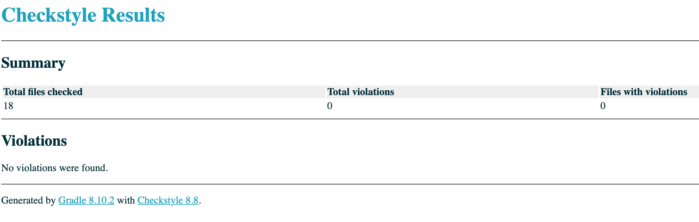
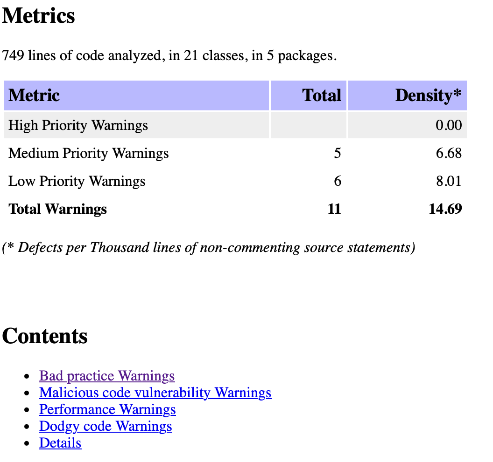

# Project Overview 
This project aims to integrate tools like JUnit,  Jacoco, CheckStyle, and SpotBugs for ensuring robust code quality and test coverage. 
The workflow will include writing clean, efficient code with a focus on specific design patterns to enhance maintainability and scalability.

## Project Flow and Source Code Explanation
 Steps to Complete the Project: **
>     Configure Gradle for dependency management and build automation. integrate JUnit for testing, Jacoco for test coverage, CheckStyle for code styl enforcement, and SpotBugs for static analysis.
    
 Design Patterns
>      Singleton Pattern 
            Use for managing shared resources like configuration settings or logging.
        
 Factory Pattern  **
>   implement for creating instances of complex objects, especially where multiple configurations are required.
       
  Observer Pattern **
>   Employ for handling event-driven communication between components, such as notifying listeners of state changes.
    
Builder Design Pattern **
>   

## JUnit / Jacoco
> Inforce coding standards to ensure consistency and readability across the project.

## CheckStyle
> Enforce coding standards to ensure consistency and readability across the project.
 -> checkstyle main/ reflect on checkstyle test as well
 -> SpotBugs
## Spotbugs
> Perform static analysis to identify and fix potential bugs or code smells.
> 
## Link for Screencast 

[Github_link : 1] (https://github.com/Bjablaso/Bjablason_SiliconVSim) : Repo
[Github_link : 2] (https://github.com/Bjablaso/Bjablason_SiliconVSim/blob/main/SiliconVSim.md) : Read me
[Github_link : 3] : checkstyle
[Github-link : 4] : spotbugs
[Github-link : 5] : Jacoco

